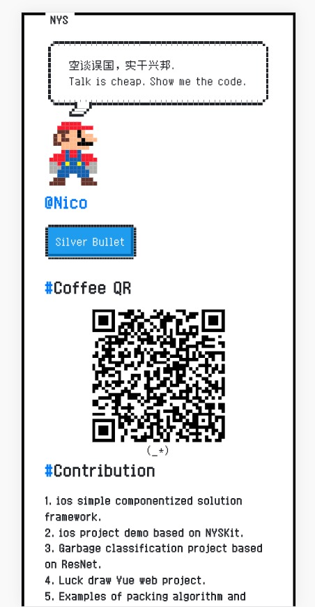

# pixel-homepage
> 极简像素风个人主页 
> Minimalist pixel style personal homepage.
## Link
https://niyongsheng.github.io/pixel_homepage/

## Desc
* 微信浏览器下会提示跳转系统浏览器；
* 系统浏览器下支持点击二维码拉起支付宝；
* 彩蛋；

## Demo

## Browser
|  IE / Edge |  Firefox |  Chrome |  Safari |
|:---------:|:---------:|:---------:|:---------:|
| IE9+, Edge | &check;| &check; | &check; 

## Me
* Sina: [@Ni永胜](https://weibo.com/u/7317805089)
* Mail: niyongsheng@Outlook.com